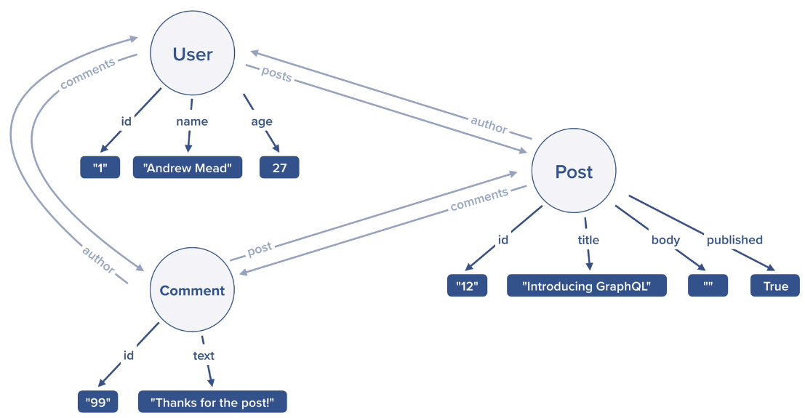

# GraphQL

1. GraphQL = Graph Query Language
1. Any client (web, mobile, server), any language, any database
1. Because you write your query on the client, the client controls what data you get
   - Not the server
   - With a rest api, it is the server that determines what is returned
1. Fewer http requests
   - Flexible data querying
   - Less code to manage...
1. GraphQL is self documenting

[GraphQL Specification](http://spec.graphql.org/)

## What is a Graph



# Setup

1. Install [babel](https://babeljs.io/)
   - Javascript compiler
   - Allows use of modern js, but allows code to run in all browsers
   ```
   npm install babel-cli babel-preset-env
   ```
   - Create a .babelrc config file
   ```
   {
       "presets": [
           "env"
       ]
   }
   ```
1. Install graphql-yoga
   ```
   npm install graphql-yoga
   ```
   - [Documentation](https://github.com/dotansimha/graphql-yoga)
   - This package is fully featured, and easy to use
   - The sweet 'playground' is a feature of graphql-yoga
1. Live Reload for GraphQL-Yoga
   - Using nodemon
   ```
   npm install nodemon --save-dev
   ```
1. Install GraphQL extension
   - Allows us to create .graphql files
   - Syntax highlighting, intellisense, etc...

# GraphQL Queries

[Instructor demo site](graphql-demo.mead.io) for graphql queries

- We will be building our own api and client

## Simple Query

```graphql
query {
	hello
	course
	courseInstructor
}
```

## Nested Query

An object

```graphql
query {
	hello
	course
	courseInstructor
	me {
		id
		name
		email
	}
}
```

An array of values

```graphql
query {
	users {
		name
		email
	}
}
```

# GraphQL Types

## Scalar Types

1. String
1. Boolean
1. Int
1. Float
1. ID

```js
const typeDefs = `
    type Query {
        title: String!
        price: Float!
        releaseYear: Int
        rating: Float
        inStock: Boolean!
    }
`;

// Resolvers
const resolvers = {
	Query: {
		title() {
			return 'The War of Art';
		},
		price() {
			return 12.99;
		},
		releaseYear() {
			return;
		},
		rating() {
			return 5;
		},
		inStock() {
			return true;
		},
	},
};
```

## Custom Types

1. Structured similarly to the Query
1. You define the properties the type should have

```js
const typeDefs = `
    type Query {
        me: User!
    }

    type User {
        id: ID!
        name: String!
        email: String!
        age: Int
    }
`;

// Resolvers
const resolvers = {
	Query: {
		me() {
			return {
				id: '123098',
				name: 'Gary',
				email: 'gary@example.com',
				age: 32,
			};
		},
	},
};
```

```graphql
query {
	me {
		id
		name
		email
	}
}
```

# Operation Arguments

- This allows us to create a query that takes in arguments

```js
const typeDefs = `
    type Query {
        greeting(name: String, position: String): String!
        add(a: Float!, b: Float!): Float!
    }  
`;

const resolvers = {
	Query: {
		greeting(parent, args, ctx, info) {
			if (args.name && args.position) {
				return `Hello, ${args.name} you are my favorite ${args.position}`;
			}

			return 'Hello';
		},
		add(parent, args, ctx, info) {
			return args.a + args.b;
		},
	},
};
```

- Notice that we have a bunch of arguments in the resolver function
- Even if you don't use them all, it's a good habit to include all of them

```graphql
query {
	greeting(name: "Gary", position: "Programmer")
	add(a: 12, b: 12)
}
```

# Arrays

## Scalar Types

```graphql
type Query {
	add(numbers: [Float!]!): Float!
	grades: [Int!]!
}
```

```js
const resolvers = {
	Query: {
		add(parent, args, ctx, info) {
			if (args.numbers.length === 0) {
				return 0;
			}

			return args.numbers.reduce((acc, cur) => {
				return acc + cur;
			});
		},
		grades(parent, args, ctx, info) {
			return [99, 80, 93];
		},
	},
};
```

```graphql
query {
	grades
	add(numbers: [1, 2, 3, 4])
}
```

## Custom Types

```graphql
type Query {
	users(query: String): [User!]!
}

type User {
	id: ID!
	name: String!
	email: String!
	age: Int
}
```

```js
const resolvers = {
	Query: {
		users(parent, args, ctx, info) {
			if (!args.query) {
				return users;
			}

			return users.filter((user) => {
				return user.name.toLowerCase().includes(args.query.toLowerCase());
			});
		},
	},
};
```

```graphql
query {
	users(query: "A") {
		id
		name
		email
		age
	}
}
```

# Relational Data and Queries

1. With relational data, we are linking two User defined types together
1. The big takeaway is that we develop resolvers for our user defined types that will then return the child relationship
   - Post resolver will return a User that wrote the post
   - User resolver will return all the Posts a user wrote
1. It builds off of what is defined in the Query resolver
   - This resolver will be considered the 'parent'
   - So, the Query resolver returns a 'users' function (all Users)
   - The User resolver will then allow us to query for posts
1. Putting it all together will result in queries that look like this:
   ```graphql
   query {
   	users {
   		id
   		name
   		email
   		age
   		posts {
   			id
   			title
   			comments {
   				text
   			}
   		}
   	}
   }
   ```
   - Relationally, a user has posts, posts have comments
   - In this case, we could even query for a post in the comments!
1. Worth noting, GraphQL relationships don't necessarily match database ones!
   - We add a List of Comments to a Post for GraphQL
   - Post Id on the Comment table relationally

## Basics

- We are linking a Post to an Author
  - Adding an author field to Post
- The idea is that a post will have a user id field
  - In the db
- We create a resolver function (similar to Query)
  - This will return our user when we query a Post

```graphql
type Query {
	users(query: String): [User!]!
	posts(query: String): [Post!]!
}

type User {
	id: ID!
	name: String!
	email: String!
	age: Int
}

type Post {
	id: ID!
	title: String!
	body: String!
	published: Boolean!
	author: User!
}
```

```js
const resolvers = {
	Query: {
		users(parent, args, ctx, info) {
			if (!args.query) {
				return users;
			}

			return users.filter((user) => {
				return user.name.toLowerCase().includes(args.query.toLowerCase());
			});
		},
		posts(parent, args, ctx, info) {
			if (!args.query) {
				return posts;
			}

			return posts.filter((post) => {
				const isTitleMatch = post.title
					.toLowerCase()
					.includes(args.query.toLowerCase());
				const isBodyMatch = post.body
					.toLowerCase()
					.includes(args.query.toLowerCase());

				return isTitleMatch || isBodyMatch;
			});
		},
	},
	Post: {
		author(parent, args, ctx, info) {
			return users.find((user) => {
				return user.id === parent.author;
			});
		},
	},
};
```

```graphql
query {
	posts {
		id
		title
		body
		published
		author {
			name
		}
	}
}
```

- As you can see, it builds on the Query resolver
- The posts() in the query resolver is the 'parent' parameter

## Arrays

- Really a one to many relationship
- Added the `posts: [Post!]!`
- Doing an array filter instead of an array find
  - Instead of expecting one result, we expect 1 to many

```graphql
type Query {
	users(query: String): [User!]!
	posts(query: String): [Post!]!
}

type User {
	id: ID!
	name: String!
	email: String!
	age: Int
	posts: [Post!]!
}

type Post {
	id: ID!
	title: String!
	body: String!
	published: Boolean!
	author: User!
}
```

```js
const resolvers = {
	Query: {
		users(parent, args, ctx, info) {
			if (!args.query) {
				return users;
			}

			return users.filter((user) => {
				return user.name.toLowerCase().includes(args.query.toLowerCase());
			});
		},
		posts(parent, args, ctx, info) {
			if (!args.query) {
				return posts;
			}

			return posts.filter((post) => {
				const isTitleMatch = post.title
					.toLowerCase()
					.includes(args.query.toLowerCase());
				const isBodyMatch = post.body
					.toLowerCase()
					.includes(args.query.toLowerCase());

				return isTitleMatch || isBodyMatch;
			});
		},
	},
	User: {
		posts(parent, args, ctx, info) {
			return posts.filter((post) => {
				return post.author === parent.id;
			});
		},
	},
};
```

```graphql
query {
	users {
		id
		name
		email
		age
		posts {
			id
			title
		}
	}
}
```

## Object Spread Operator

1. We will be using a module for this
   - [babel-plugin-transform-object-rest-spread](https://www.npmjs.com/package/babel-plugin-transform-object-rest-spread)
   ```
   npm babel-plugin-transform-object-rest-spread
   ```
1. Setup plugins in .babelrc
   ```
   {
     "presets": ["env"],
     "plugins": ["transform-object-rest-spread"]
   }
   ```
1. Use the spread operator
   - Old
   ```js
   const user = {
   	id: uuidv4(),
   	name: args.name,
   	email: args.email,
   	age: args.age,
   };
   ```
   - New
   ```js
   const user = {
   	id: uuidv4(),
   	...args,
   };
   ```

## The Input Type

1. Mutations tend to have lots of inputs
   ```graphql
   type Mutation {
   	createUser(name: String!, email: String!, age: Int): User!
   	createPost(
   		title: String!
   		body: String!
   		published: Boolean!
   		author: ID!
   	): Post!
   	createComment(text: String!, author: ID!, post: ID!): Comment!
   }
   ```
1. We can define our own input types

   ```graphql
   type Mutation {
   	createUser(input: CreateUserInput!): User!
   }

   input CreateUserInput {
   	name: String!
   	email: String!
   	age: Int
   }
   ```

# Mutations (Insert, Delete, Update)

1. In order to create data, we need a package to generate ids

   - [uuid](https://www.npmjs.com/package/uuid)

   ```
   npm install uuid
   ```

1. In general, mutations work similarly to query in design and function

## Insert

```graphql
type Mutation {
	createUser(name: String!, email: String!, age: Int): User!
}

type User {
	id: ID!
	name: String!
	email: String!
	age: Int
	posts: [Post!]!
	comments: [Comment!]!
}
```

```js
const resolvers = {
	Mutation: {
		createUser(parent, args, ctc, info) {
			const emailTaken = users.some((user) => {
				return user.email === args.email;
			});

			if (emailTaken) {
				throw new Error('Email taken');
			}

			const user = {
				id: uuidv4(),
				name: args.name,
				email: args.email,
				age: args.age,
			};

			users.push(user);

			return user;
		},
	},
};
```

```graphql
mutation {
	createUser(name: "Gary", email: "test@test.com") {
		id
		name
		email
		age
	}
}
```

## Delete

```graphql
type Mutation {
	deleteUser(id: ID!): User!
}

type User {
	id: ID!
	name: String!
	email: String!
	age: Int
	posts: [Post!]!
	comments: [Comment!]!
}
```

```js
const resolvers = {
	Mutation: {
		deleteUser(parent, args, { db }, info) {
			const userIndex = db.users.findIndex((user) => user.id === args.id);

			if (userIndex === -1) {
				throw new Error('User not found');
			}

			const deletedUsers = db.users.splice(userIndex, 1);

			db.posts = db.posts.filter((post) => {
				const match = post.author === args.id;

				if (match) {
					db.comments = comments.filter((comment) => comment.post !== post.id);
				}

				return !match;
			});

			db.comments = db.comments.filter((comment) => comment.author !== args.id);

			return deletedUsers[0];
		},
	},
};
```

## Update

```graphql
type Mutation {
	updateUser(id: ID!, data: UpdateUserInput): User!
}

type User {
	id: ID!
	name: String!
	email: String!
	age: Int
	posts: [Post!]!
	comments: [Comment!]!
}
```

```js
const resolvers = {
	Mutation: {
		updateUser(parent, args, { db }, info) {
			const { id, data } = args;
			const user = db.users.find((user) => user.id === id);

			if (!user) {
				throw new Error('User not found');
			}

			if (typeof data.email === 'string') {
				const emailTaken = db.users.some((user) => user.email === data.email);

				if (emailTaken) {
					throw new Error('Email taken');
				}

				user.email = data.email;
			}

			if (typeof data.name === 'string') {
				user.name = data.name;
			}

			if (typeof data.age !== 'undefined') {
				user.age = data.age;
			}

			return user;
		},
	},
};
```

# GraphQL Subscriptions

- Client subscribes to data changes on server
- Uses websockets in the background
  - Open connection b/t client and server
  - 'real-time' application
- Query is a one-time fetch
- We will be using a package that graphql-yoga
  - graphql-subscriptions

## Setup

```graphql
type Subscription {
	count: Int!
}
```

```js
import { GraphQLServer, PubSub } from 'graphql-yoga';
import Subscription from './resolvers/Subscription';

const pubsub = new PubSub();

const server = new GraphQLServer({
	typeDefs: './src/schema.graphql',
	resolvers: {
		Subscription,
	},
	context: {
		pubsub,
	},
});
```

```js
const Subscription = {
	count: {
		subscribe(parent, args, { pubsub }, info) {
			let count = 0;

			setInterval(() => {
				count++;
				pubsub.publish('count', {
					count,
				});
			}, 1000);

			return pubsub.asyncIterator('count');
		},
	},
};

export { Subscription as default };
```

## Enums

```graphql
enum MutationType {
	CREATED
	UPDATED
	DELETED
}

type PostSubscriptionPayload {
	mutation: MutationType!
	data: Post!
}

type CommentSubscriptionPayload {
	mutation: MutationType!
	data: Comment!
}
```

```js
if (post.published) {
	pubsub.publish('post', {
		post: {
			mutation: 'CREATED',
			data: post,
		},
	});
}
```

- So you still have to use strings on the js side
- But if you mispell, graphQL will throw an error

# Database with Prisma v1

1. Prisma is a GraphQL ORM
1. Prisma supports multiple databases
   - Mongo, MySQL, etc
1. So our backend can read from the db using GraphQL
   - Keeps our communication b/t the front end and db the same
   - Server becomes much less important
   - Almost as if the client is directly connected to db
1. Prisma uses the same command from client to server to the db
1. The biggest lift with Prisma, is that it creates all the things we had to manually create before
   - Subscriptions, mutations, crud, etc
1. Prisma on docker will have it's own playground (separate from our client based one)
   - localhost:4466 (prisma) vs localhost:4000 (project/client)


## Postgres Through Heroku

1. [Heroku](https://www.heroku.com/) lets you create apps that will host our database
1. Create app `hake-prisma-dev-server`
   - Go to the overview tab
1. Search for `Heroku Postgres` add-on
   - Make sure you use the free version!
1. Go to the settings to figure out how to connect to the db

### PGAdmin

1. This is a gui we will install to manage our database
1. [Link](https://www.pgadmin.org/download/pgadmin-4-windows/)
1. The server we are using has a ton of databases
   - It's a pain to find ours

### Docker

1. We will be using docker to host and run Prisma
1. [Link](https://www.docker.com/get-started)

## Prisma

1. [Officical Website](https://www.prisma.io/)
1. Install
   ```bash
   npm install -g prisma1
   ```
   - Prisma is on v3, but there was a big philosophical switch b/t v1 and v2
   - We are going to use v1 for now, so we have to specifically install that version
1. Prisma also has a vscode extension
1. Prisma init
   ```bash
   prisma1 init prisma
   ```
   - Supposed to create a folder with 3 files
     - datamodel.graphql (datamodel files)
     - docker-compose.yml (docker compose config)
     - prisma.yml (prisma config for db)
1. `datamodel.graphql` is the most important of the 3
   - Where we define our db schema
1. Commands
   - From within the prisma folder
   ```bash
   docker-compose up -d
   ```
   - Once the docker image is running
   ```bash
   prisma deploy
   ```
   - Pushes most recent changes to live db
1. Make sure you create a .env file for your secret vars
   - Located within the prisma folder
1. The big benefit of Prisma, is that you just create the base table (Users), and prisma creates all the subscriptions for you
   - Add, Delete, Update, Select

## Hooking up Node to Prisma

1. At this point, prisma is doing crud operations to the postgres database
1. First package [prisma-binding](https://github.com/prisma-labs/prisma-binding)
   - **Only works with Prisma1**
   ```bash
   npm install prisma-binding
   ```
1. [GraphQL CLI](https://www.graphql-cli.com/introduction/)
   - Fetching schema from prisma
1. We are supposed to use graphql cli to generate our subscriptions
   - The course's stuff, didn't work, but there was a workaround
   - Install a separate package
   ```bash
   npm install -g get-graphql-schema
   ```
   - Update the package.config script:
   ```config
   npm install -g get-graphql-schema
   ```
   - Use the command
   ```bash
   npm run get-schema
   ```

## Prisma Bindings

The playground that is auto-launched with prisma (in docker) is helpful to develop the below code blocks

- It will give you an idea of the available prisma functions
- It will show you how those functions operate (inputs)

Include and instantiate:

```js
import { Prisma } from 'prisma-binding';

const prisma = new Prisma({
	typeDefs: 'src/generated/prisma.graphql',
	endpoint: 'http://localhost:4466',
});
```

### Query

```js
prisma.query.users(null, '{ id name posts { id title } }').then((data) => {
	console.log(JSON.stringify(data, undefined, 2));
});

prisma.query.comments(null, '{ id text author { id name } }').then((data) => {
	console.log(JSON.stringify(data, undefined, 2));
});
```

### Mutations

Creating a post:

```js
prisma.mutation
	.createPost(
		{
			data: {
				title: 'GraphQL 101',
				body: '',
				published: false,
				author: {
					connect: {
						id: 'ckwgtc90j00eq0995aii2ggm1',
					},
				},
			},
		},
		'{ id title body published }'
	)
	.then((data) => {
		console.log(data);
	});
```

With promise chaining, we can query after a mutation:

```js
prisma.mutation
	.createPost(
		{
			data: {
				title: 'GraphQL 101',
				body: '',
				published: false,
				author: {
					connect: {
						id: 'ckwgtc90j00eq0995aii2ggm1',
					},
				},
			},
		},
		'{ id title body published }'
	)
	.then((data) => {
		console.log(data);
		return prisma.query.users(null, '{ id name posts { id title } }');
	})
	.then((data) => {
		console.log(JSON.stringify(data, undefined, 2));
	});
```

Updating a post:

```js
prisma.mutation
	.updatePost(
		{
			where: {
				id: 'ckwh036f100jl09954vl5rhy7',
			},
			data: {
				body: 'This is how to get started with Graphql...',
				published: true,
			},
		},
		'{ id }'
	)
	.then((data) => {
		return prisma.query.posts(null, '{ id title body published }');
	})
	.then((data) => {
		console.log(data);
	});
```

### Async/Await

The idea is that functionally everything works the same above (with promises), but the syntax is cleaner w/ async/await

```js
const createPostForUser = async (authorId, data) => {
	const post = await prisma.mutation.createPost(
		{
			data: {
				...data,
				author: {
					connect: {
						id: authorId,
					},
				},
			},
		},
		'{ id }'
	);

	const user = await prisma.query.user(
		{
			where: {
				id: authorId,
			},
		},
		'{ id name email posts { id title published } }'
	);

	return user;
};

createPostForUser('ckwh11j6600kj0995jqewc3yf', {
	title: 'Great books to read',
	body: 'The War of Art',
	published: true,
}).then((user) => {
	console.log(JSON.stringify(user, undefined, 2));
});
```

### Checking if Data Exists

Allows us to confirm an item exists before updating

```js
prisma.exists
	.Comment({
		id: 'ckwgtfseo00h40995i0r5ntdw',
		author: {
			id: 'ckwgtc90j00eq0995aii2ggm1',
		},
	})
	.then((exists) => {
		console.log(exists);
	});
```

### Type Relationships

This is how we define delete behavior for related columns

```graphql
type Post {
	id: ID! @unique
	title: String!
	body: String!
	published: Boolean!
	author: User! @relation(name: "PostToUser", onDelete: SET_NULL)
	comments: [Comment!]! @relation(name: "CommentToPost", onDelete: CASCADE)
}
```

# Integrating Prisma to GraphQL Queries

1. Right now, the project is separated by prisma and the client side
1. We can see this by the different environments we are running the playground on
   - localhost:4466 is the prisma direct playground
   - localhost:4000 is the client based playground
1. We set up a fake, local db for the client to use, and for us to develop our graphql resolvers
1. What we want to do is to have the client use prisma to do all resolver based tasks
1. This is all very similar to what we did above

```js
users(parent, args, { prisma }, info) {
	const opArgs = {};

	if (args.query) {
		opArgs.where = {
			OR: [
				{
					name_contains: args.query,
				},
				{
					email_contains: args.query,
				},
			],
		};
	}

	return prisma.query.users(opArgs, info);
},
```

1. We are also integrating a query parameter so we can filter results
1. Graphql passes the query object, the client does the filtering

```graphql
query {
	users(query: "e@example.com") {
		id
		name
		email
	}
}
```

1. Mutations work similarly to the query above

## Locking Prisma to Outside World

1. The idea is that we don't want any user to be able to access the prisma playground (localhost:4466)
1. So we need to password protect it
1. Our node server will have the secret to access prisma, but only it
1. The way to lock it down is rather simple
   - Add secret key in prisma.yml
   ```yml
   endpoint: http://localhost:4466
   datamodel: datamodel.graphql
   secret: thisismysupersecrettext
   ```
   - Add the same in prisma.js
   ```js
   const prisma = new Prisma({
   	typeDefs: 'src/generated/prisma.graphql',
   	endpoint: 'http://localhost:4466',
   	secret: 'thisismysupersecrettext',
   });
   ```
1. How do we use the prisma playground if we want?
   - We set up a token. Run the below command in prisma folder
   ```
   prisma1 token
   ```
   - In the playground add an http header
   ```json
   {
   	"Authorization": "Bearer TOKEN"
   }
   ```

## Passwords and Auth Tokens

1. Delete the database shortcut
   ```bash
   prisma1 delete
   ```
   - Once we add the password to the users, we need to refresh everything
1. Hashing a password
   - [bcryptjs](https://www.npmjs.com/package/bcryptjs)

# TODO

1. Migrate from prisma v1 to v3
